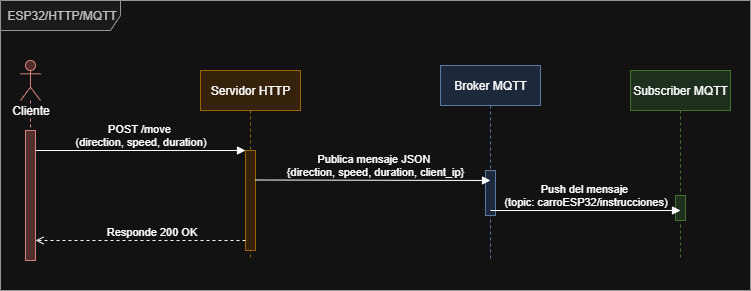

# Chucho control con HTTP y aviso a MQTT

# Integrantes
- Esteban Bernal
- Nicolas Almonacid
- Santiago Sánchez

Proyecto que implementa un controlador HTTP para un carro basado en ESP32, con publicación de instrucciones mediante el protocolo MQTT.

Permite enviar órdenes de movimiento (adelante, atrás, izquierda, derecha, detener) junto con parámetros de velocidad y duración, y además publica las instrucciones en un broker MQTT incluyendo la IP del cliente que las envió.

---

## 📋 Objetivos

- Exponer un único **endpoint HTTP** (`/move`) que reciba instrucciones de movimiento con velocidad y duración (máximo 5 segundos).
- Implementar un **endpoint de salud** (`/health`) para verificar el estado del servidor.
- Publicar las instrucciones recibidas en un **broker MQTT**, con los datos del movimiento y la IP del cliente.
- Documentar la API con **OpenAPI 3.0.0**.
- Generar un **diagrama de secuencia** explicativo.
- Publicar el proyecto en **GitHub** con documentación completa, colección Postman y recursos en carpeta `/docs`.

---

## 🧠 Tecnologías utilizadas

- **ESP32** (microcontrolador)
- **Arduino Framework**
- **WiFi.h** → conexión a red
- **WebServer.h** → servidor HTTP embebido
- **PubSubClient.h** → comunicación MQTT
- **HiveMQ** → broker MQTT público (`broker.hivemq.com`)

---

## ⚙️ Configuración del entorno

### 1️⃣ Requisitos

- Arduino IDE o PlatformIO.
- Librerías:
  - `WiFi.h` (incluida por defecto)
  - `WebServer.h`
  - `PubSubClient.h`

### 2️⃣ Configurar WiFi y MQTT en el código

```cpp
const char* ssid = "Santi's Iphone";
const char* password = "farra2abril";
const char* mqtt_server = "broker.hivemq.com";
const int mqtt_port = 1883;
const char* mqtt_topic = "carroESP32/instrucciones";
```

---

## 📷 Ejemplo de suscripción

A continuación se muestra un ejemplo de lo que ve el suscriptor del tópico `carroESP32/instrucciones` cuando se publica un mensaje:


---

## 📊 Diagrama de secuencia

A continuación se presenta el diagrama de secuencia que explica el flujo de interacción entre los componentes del sistema:



En este diagrama se puede observar:

1. **Cliente**: Envía una solicitud al endpoint `/move` con las instrucciones de movimiento.
2. **Servidor HTTP**: Procesa la solicitud, ejecuta la acción correspondiente y publica el mensaje en el broker MQTT.
3. **Broker MQTT**: Recibe y distribuye el mensaje a los suscriptores del tópico `carroESP32/instrucciones`.
4. **Suscriptor MQTT**: Recibe el mensaje publicado y lo muestra.

---

## 📁 Estructura del repositorio

```bash

/docs
├── Diagrama.drawio.png
├── Subscriber.png
└── ESP32-Car-Control.postman_collection.json
└── openapi.yaml
README.md
main.ino
```

