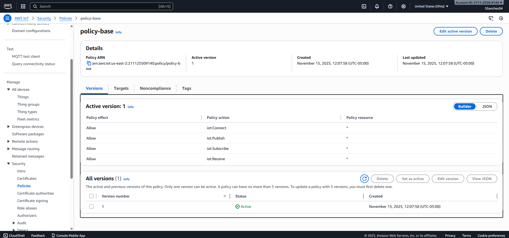
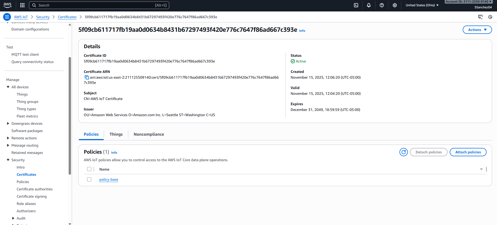
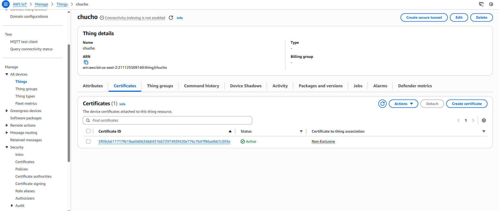
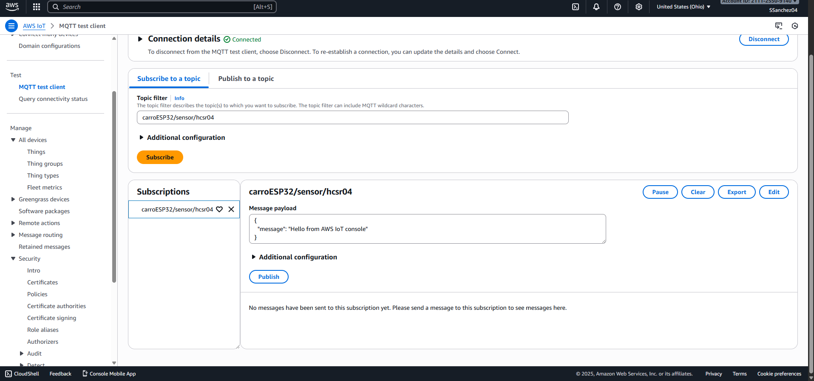
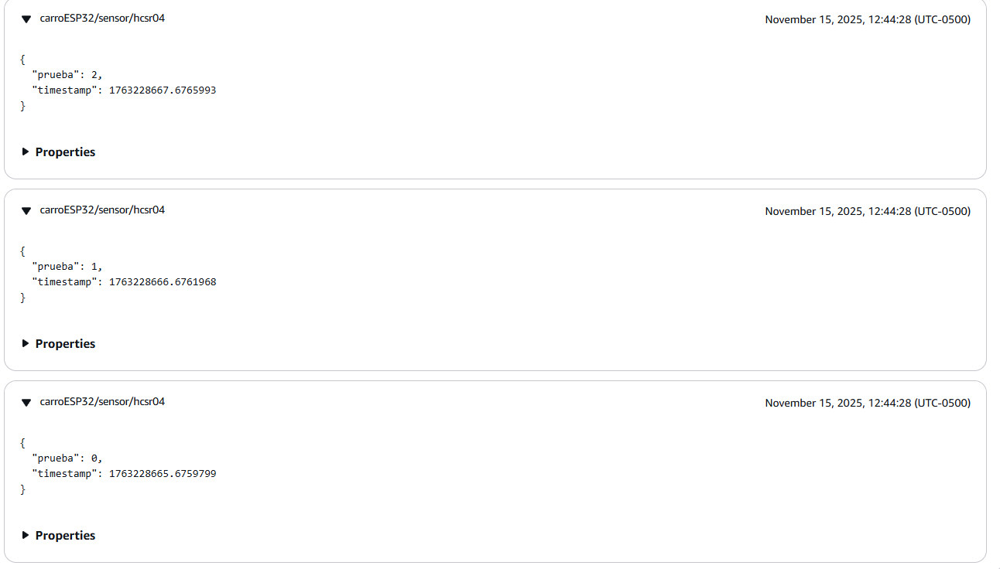

# CERTIFICATES.md

## 1. ¿Qué es el protocolo TLS, cuál es su importancia y qué es un certificado en ese contexto?
**TLS (Transport Layer Security)** es un protocolo criptográfico que protege la comunicación en red proporcionando confidencialidad, integridad y autenticación entre clientes y servidores. TLS se usa para asegurar protocolos como HTTPS, MQTT sobre TLS, SMTP, etc. Su importancia radica en que evita que atacantes intercepten (e.g. sniffing), modifiquen (man-in-the-middle) o suplanten a las partes que se comunican. AWS IoT Core y otros gateways de IoT requieren TLS para cifrar el tráfico de los dispositivos hacia la nube.

Un **certificado TLS** (certificado X.509) es un documento digital firmado por una autoridad de certificación (CA) que vincula una clave pública con una identidad (p. ej. un dominio o un dispositivo). Durante el handshake TLS el servidor (y/o el cliente en mTLS) presenta su certificado para que la otra parte lo valide y pueda cifrar/comprobar la sesión.

---

## 2. ¿A qué riesgos se está expuesto si no se usa TLS?
Sin TLS el tráfico queda en texto plano o sin garantías criptográficas:  
- Interceptación de credenciales y datos (e.g. contraseñas, ubicaciones).  
- Modificación de mensajes en tránsito (inyección de comandos maliciosos).  
- Suplantación de la identidad del servidor (DNS spoofing + MITM).  
- Robo de información sensible y pérdida de integridad en telemetría.  
En contextos IoT esto puede significar control remoto no autorizado del dispositivo o fuga de datos.

---

## 3. ¿Qué es un CA (Certificate Authority)?
Un **CA (Certificate Authority)** es una entidad confiable que emite y firma certificados X.509. La cadena de confianza se establece porque los sistemas confían en ciertos **root CA** preinstalados; estos root CA firman intermediarios que a su vez firman certificados de servidor/cliente. Las CAs gestionan procesos de verificación de identidad, revocación y emisión.

---

## 4. ¿Qué es una cadena de certificados y cuál es la vigencia promedio de los eslabones?
Una **cadena de certificados** (chain of trust) va desde el **certificado final** (leaf — p. ej. `device.example.com`) → **certificado(s) intermedio(s)** → **root CA**. El cliente valida que cada certificado esté firmado por el siguiente en la cadena hasta llegar a un root de confianza.

Respecto a vigencias típicas (valores aproximados y sujetos a cambios regulatorios):  
- **Root CA**: vigencia larga (p. ej. 10–25 años).  
- **Intermediate CA**: vigencias intermedias (p. ej. 1–15 años según CA).  
- **Certificados de servidor/cliente (leaf)**: históricamente hasta ~1–2 años; desde 2020 muchos navegadores limitaron a 398 días (~13 meses). Normativas recientes (CA/Browser Forum) proponen reducciones adicionales: hay movimientos para reducir aún más (por ejemplo, calendarios que llevan a 47 días en fases futuras), por lo que conviene verificar la política actual de la CA al emitir.

---

## 5. ¿Qué es un keystore y qué es un certificate bundle?
- **Keystore**: contenedor seguro que guarda claves privadas y certificados (formatos comunes: PKCS#12 `.p12/.pfx`, Java Keystore `.jks`). Se usa para almacenar la **clave privada** asociada a un certificado y, con frecuencia, la cadena completa.  
- **Certificate bundle** (o *CA bundle*): archivo que agrupa uno o varios certificados públicos de CA (root + intermediates) en formato PEM. Se usa para que un cliente o servidor tenga disponibles las CA de confianza necesarias para validar cadenas.

---

## 6. ¿Qué es la autenticación mutua en el contexto de TLS?
La **autenticación mutua (mTLS)** es cuando ambas partes (cliente y servidor) presentan certificados y se autentican mutuamente durante el handshake TLS. En IoT, mTLS se usa frecuentemente: el dispositivo presenta su certificado cliente firmado por una CA y AWS IoT valida ese certificado antes de aceptar la conexión. mTLS ofrece un nivel más alto de seguridad que la autenticación solo del servidor. 

---

## 7. ¿Cómo se habilita la validación de certificados en el ESP32?
En ESP32 (Arduino) se suele usar `WiFiClientSecure`. Para **validar el certificado del servidor** hay dos rutas comunes:
1. **Establecer el CA raíz (o bundle)** con `espClient.setCACert(root_ca_pem)` (o versiones con BearSSL). Esto obliga al ESP32 a validar el certificado del servidor contra ese CA.  
2. (Alternativa) Validar por **fingerprint**/SHA256 del certificado del servidor (menos flexible) usando funciones específicas de la librería.

Para **mTLS** (autenticación mutua) se usan `espClient.setCertificate(client_cert_pem)` y `espClient.setPrivateKey(client_key_pem)` para presentar el certificado del dispositivo y su clave privada durante el handshake. Ejemplos y detalles prácticos están en tutoriales de ESP32 y foros.

---

## 8. Si el sketch necesita conectarse a múltiples dominios con certificados generados por CAs distintos, ¿qué alternativas hay?
Opciones prácticas:
- **Incluir un bundle de CA** que contenga todas las raíces/intermedias necesarias (concatenar PEMs). El ESP32 lo usará para validar cualquiera de esos dominios.  
- **Almacenar certificados por dominio** y seleccionar el CA apropiado según el SNI (Server Name Indication) antes de conectar.  
- **Validación por huella (fingerprint)** por dominio si no quieres un bundle (menos flexible y obliga a rotar la huella cuando cambie el certificado).  
- **Usar una CA interna** (emitir todos los certificados desde la misma CA) y cargar solo esa CA en el dispositivo.  
Cada alternativa tiene compromisos entre flexibilidad, tamaño de memoria y operatividad en campo.

---

## 9. ¿Cómo se puede obtener el certificado para un dominio?
Formas comunes:
- **Abrir el dominio en un navegador** → clicar el candado → exportar certificado (PEM).  
- **OpenSSL**: `openssl s_client -showcerts -connect example.com:443` y extraer los bloques `-----BEGIN CERTIFICATE-----` … `-----END CERTIFICATE-----`.  
- **Herramientas como `curl --insecure --verbose`** o servicios online (menos recomendados por seguridad)

---

## 10. ¿A qué se hace referencia cuando se habla de llave pública y privada en TLS?
- **Clave pública**: parte de un par de claves; se distribuye dentro del certificado y sirve para cifrar datos al destinatario correcto o para verificar firmas creadas con la clave privada.  
- **Clave privada**: debe mantenerse secreta; se usa para descifrar datos cifrados con la pública (en ciertos esquemas) y para firmar (por ejemplo, firma del servidor durante TLS para demostrar que posee la clave asociada al certificado). La seguridad depende de que la clave privada nunca se revele.

---

## 11. ¿Qué pasará con el código cuando los certificados expiren?
Cuando un certificado (root/intermedio/leaf) necesario para la validación caduque:  
- El **handshake TLS fallará** y la conexión será rechazada. En el dispositivo embebido, las funciones de conexión retornarán error o simplemente no conectarán.  
- Por eso es crítico **rotar/renovar** certificados antes de su expiración y diseñar actualizaciones OTA o mecanismos seguros de reprovisionamiento. Plan de contingencia recomendado: monitoreo de expiración, automatización de emisión/rotación y actualización segura en campo (por ejemplo, firmware OTA o almacenamiento en filesystem).

---

## 12. ¿Qué teoría matemática fundamenta la criptografía moderna? ¿Qué implicaciones trae la computación cuántica?
Fundamentos actuales:
- **RSA**: basado en la dificultad de la factorización de enteros grandes (teoría de números).  
- **Algoritmos basados en logaritmo discreto** (Diffie-Hellman, DSA) y **criptografía en curvas elípticas (ECC)**, basados en problemas difíciles sobre grupos algebraicos y curvas elípticas.  
- **Primitives modernas** (AES, hash functions) se basan en diseño algorítmico y propiedades combinatorias.

**Computación cuántica**: algoritmos cuánticos (p. ej. **Shor**) pueden factorizar enteros y resolver el problema del logaritmo discreto eficientemente, lo que rompería RSA y ECC. Por ello hay un movimiento hacia **criptografía post-cuántica** (lattice-based, code-based, multivariate, hash-based) y estándares emergentes para migrar. La recomendación práctica hoy es planificar la transición (crypto-agility) y usar esquemas resistentes a ataques cuánticos cuando sea necesario.

---

## 13. Evidencia de ejecución y pruebas realizadas

A continuación se documentan las pruebas solicitadas en la actividad, junto con la evidencia correspondiente y la referencia a los archivos modificados dentro del proyecto.

## **Prueba 0 - Configuración en AWS IoT Core**
Para permitir la comunicación MQTTS (MQTT+TLS) se migró de un broker público (HiveMQ) hacia AWS IoT Core, que permite cargar, expedir y verificar certificados para hacer el mTLS, para eso se hicieron las siguientes tareas:

1. Se crea una policy que permita al carro asociado al certificado que haga ciertas tareas y llamadas a la API de IoT de AWS.


2. Se creó un certificado en AWS, acá se generaron los diferentes archivos de (`AmazonRootCA1.pem`, `certificate.pem.crt`, `private.pem.key`) para ser cargados al carrito.


3. Se creó el "Thing" chucho, esto es la forma en que se le puede asociar un certificado válido al carro.


4. Para suscribirse al tópico y escuchar lo que se publica se puede acceder al `MQTT Test Client` de AWS, acá uno se puede suscribir a un tópico o publicar en un tópico y ver los mensajes que están en él.


### **Prueba 1 — Cambio al puerto seguro (MQTTS)**
Se modificó el código de conexión para usar el **puerto seguro 8883** en lugar del puerto MQTT sin cifrado.  
El objetivo era verificar si la conexión se mantenía sin habilitar aún la validación de certificados.

**Resultado:** la conexión **no se estableció**, lo cual es el comportamiento esperado al intentar usar un puerto TLS sin la configuración criptográfica necesaria.

_No se adjunta imagen porque no se generan mensajes en AWS IoT (no se recibe ninguna publicación), lo cual confirma el comportamiento esperado._

---

### **Prueba 2 — Habilitar la validación de certificados sin cargar certificados al ESP32**
Se habilitó la validación del certificado del servidor (`setCACert(...)`) sin haber cargado ningún certificado raíz en el dispositivo.

**Resultado:** la conexión **falló nuevamente**, ya que el ESP32 no contaba con un CA para validar el certificado presentado por AWS IoT.

_Tampoco se adjunta evidencia visual porque el resultado es la ausencia de mensajes recibidos en AWS IoT._

---

### **Prueba 3 — Cargar certificados (Root CA, certificado del dispositivo y clave privada)**
Se añadieron al proyecto los archivos:

- `certs/rootCA.pem`  
- `certs/deviceCert.pem`  
- `certs/deviceKey.pem`

Y se configuraron en el código con:

```cpp
espClient.setCACert(root_ca_pem);
espClient.setCertificate(device_cert_pem);
espClient.setPrivateKey(device_key_pem);
```

**Resultado:** Se adjunta captura del MQTT Test Client donde se observan los mensajes publicados desde el dispositivo tras cargar los certificados.


